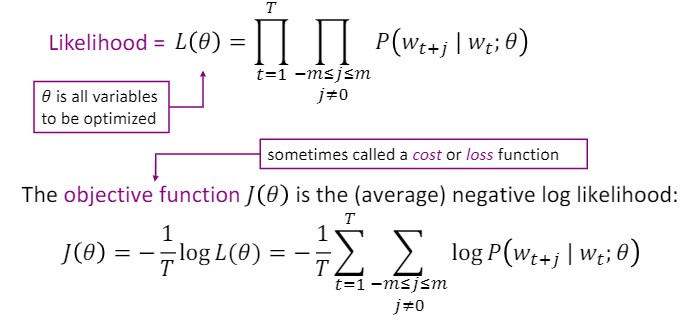
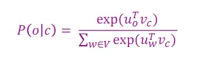

# Lecture 1: Introduction to Word Vectors

## Key Notes
In **traditional NLP**, we use one-hot vector to represent each word. Such as,
```
queen = [0, 0, 0, 0, ..., 0, 1, 0, ..., 0, 0]
```
The one-hot vectors have a fixed dimension which is equal to the size of all words. Every element refers to a specific word. For a given word, we set the element refers to this word as 1, and other elements as 0.

Some defects with one-hot vector representation:

1. We can not handle with size-changing corpus. The size of corpus is equal to vector dimension. For example, to make representation for new word, we need expand the dimension for all existing vectors.
2. **More importantly, we can not measure the semantic relationship (like the similarity) between different words**.

---

Later, the **distributional representation** theory was proposed. In distributional representation theory, the meaning of a word is determined by the contexts company it. The word vectors are dense vectors, and we can randomly choose the dimension.

**Word2vec** is a well-known framework for learning words' distributional representation. Word2vec aims to minimalize the followed objective function.



Basically, this objective function is to maximize the likelihood of probability of context words around a word.

The function to calculate the probability is below, just a softmax function.



**Note that the only parameters in this framework is the word vectors. No more other parameters.**

Then we do optimazation on the objective function and fine-tune the vectors' values as the training to get the final word vectors.

---

The distributional representation for words we learnt contain implied semantic meaning. And we can conduct semantic inference using these vectors. Such as,

```
vector(queen) - vector(woman) + vector(man) = vector(king)
```

We can inquire the most similar words to a word etc.