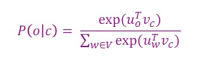
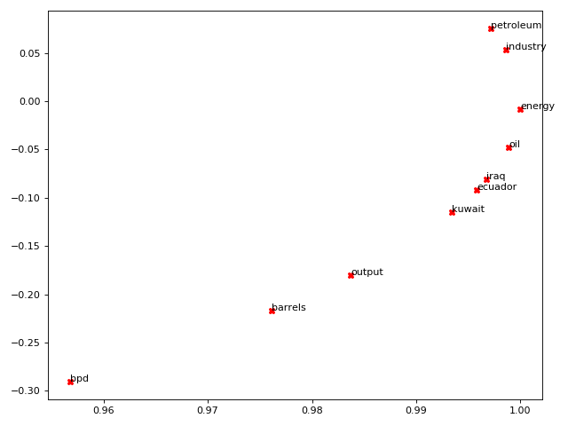
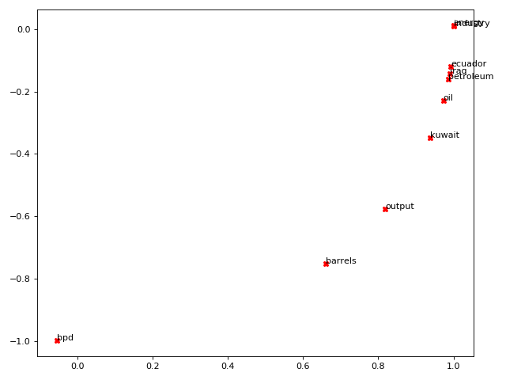

# Lecture 1: Introduction to Word Vectors

## Key Notes of Slides
### 1. One-hot Representation
In **traditional NLP**, we use one-hot vector to represent each word. Such as,
```
queen = [0, 0, 0, 0, ..., 0, 1, 0, ..., 0, 0]
```
The one-hot vectors have a fixed dimension which is equal to the size of all words. Every element refers to a specific word. For a given word, we set the element refers to this word as 1, and other elements as 0.

Some defects with one-hot vector representation:

- We can not handle with size-changing corpus. The size of corpus is equal to vector dimension. For example, to make representation for new word, we need expand the dimension for all existing vectors. 
- **More importantly, we can not measure the semantic relationship (like the similarity) between different words**.

</r>

### 2. Distributional Representation
Later, the **distributional representation** theory was proposed. In distributional representation theory, the meaning of a word is determined by the contexts company it. The word vectors are dense vectors, and we can randomly choose the dimension.

**Word2vec** is a well-known framework for learning words' distributional representation. Word2vec aims to minimalize the followed objective function.


Basically, this objective function is to maximize the likelihood of probability of context words around a word.

The function to calculate the probability is below, just a softmax function.



**Note that the only parameters in this framework is the word vectors. No more other parameters.**

Then we do optimazation on the objective function and fine-tune the vectors' values as the training to get the final word vectors.

### 3. Semantic Meaning
The distributional representation for words we learnt contain implied semantic meaning. And we can conduct semantic inference using these vectors. Such as,

```
vector(queen) - vector(woman) + vector(man) = vector(king)
```

We can inquire the most similar words to a word etc.

---

## Assignment 1
The Code is in file assignment1.py

For the graphic result in Part1:



Analysis: Suprisingly, the word 'bpd' is quite distant from other oil-related words. Other that that, results are quite understandable. Iraq is more associated with oil-related things than other two countries.

For the graphic result in Part2:



Analysis: Relative position of these words are very the same. Ecuador and Iraq converge more closely, and keep a bigger distance away from kuwait, even though kuwait and Iraq are geographically more close.

- Polyseme:
```
print(wv_from_bin.most_similar('mouse'))
```
> output: ('mice', 0.6580958366394043), ('keyboard', 0.5548278093338013), ('rat', 0.5433950424194336), ('rabbit', 0.5192376971244812), ('cat', 0.5077415704727173), ('cursor', 0.5058691501617432), ('trackball', 0.5048903226852417), ('joystick', 0.4984104633331299), ('mickey', 0.47242850065231323), ('clicks', 0.4722806215286255)

<!-- Synonym I found:
```
wv_from_bin.most_similar('almost')
wv_from_bin.most_similar('nearly')
```

> [('nearly', 0.879671037197113), ('just', 0.7620278000831604), ('only', 0.756145179271698), ('though', 0.7540832757949829), ('than', 0.7539218664169312), ('virtually', 0.7500045299530029), ('but', 0.7445195317268372), ('so', 0.7351697683334351), ('half', 0.7339328527450562), ('more', 0.7268467545509338)]

> [('almost', 0.8796710968017578), ('ago', 0.7605212330818176), ('than', 0.7541202902793884), ('least', 0.7476626634597778), ('half', 0.735248327255249), ('last', 0.7240304350852966), ('six', 0.7106252908706665), ('years', 0.7098610401153564), ('five', 0.7073115706443787), ('1,000', 0.704499363899231)]

'nearly' and 'almost' have more than 0.8 similarity. -->

- Synonyms & Antonyms:
```
print(wv_from_bin.distance('clever', 'stupid'))
print(wv_from_bin.distance('smart', 'stupid'))
```
> 0.4781627058982849  
0.517957866191864

- Analogies with Word Vectors:
```
pprint.pprint(wv_from_bin.most_similar(positive=['child', 'lamb'], negative=['adult']))
```
> [('cook', 0.4536786675453186), ('grilled', 0.4504958987236023), ('graham', 0.43271440267562866), ('onions', 0.4288058876991272), ('chicken', 0.42287036776542664), ('daughter', 0.42270931601524353), ('pork', 0.4148535132408142), ('son', 0.40863850712776184), ('veal', 0.4085983335971832), ('mother', 0.408262699842453)]


Bias:
```
pprint.pprint(wv_from_bin.most_similar(positive=['woman', 'worker'], negative=['man']))
print()
pprint.pprint(wv_from_bin.most_similar(positive=['man', 'worker'], negative=['woman']))
```
> [('employee', 0.6375863552093506), ('workers', 0.6068920493125916), ('nurse', 0.5837947130203247), ('pregnant', 0.5363885164260864), ('mother', 0.5321308970451355), ('employer', 0.5127025842666626), ('teacher', 0.5099576711654663), ('child', 0.5096741318702698), ('homemaker', 0.5019454956054688), ('nurses', 0.4970572590827942)]  
[('workers', 0.611325740814209), ('employee', 0.5983108878135681), ('working', 0.5615329742431641), ('laborer', 0.5442320108413696), ('unemployed', 0.536851704120636), ('job', 0.5278826355934143), ('work', 0.5223963856697083), ('mechanic', 0.5088937282562256), ('worked', 0.5054520964622498), ('factory', 0.4940454363822937)]