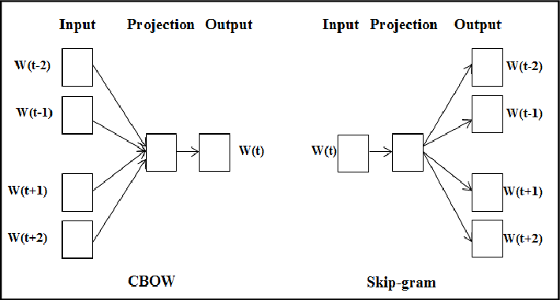

# Lecture 2: Word Vectors 2 and Word Window Classification

This lecture mainly talks about :
- Technique for parameter optimazation: Gradient Descent
- Word2vec model
- Word vectors evaluation

## Gradient Descent
Empricially we usually use stochastic gradient descent for optimazation. Two main advantages of stochastic gradient descent compared to one-sample gradient descent:
1. Sampling a batch of training data can make the optimazation process smoother.
2. Fasten the optimazation process.

## Word2vec model
Two main model variants:
- **Skip-grams**: Given a word and predict its context.
- **Continuous Bag of Words (CBOW)**: Given a context and predict its center word.

Additional efficiency in training: **Negative sampling**. Adding negative samples into the objective function and advance experimental performance. The objective function aims to minimalize the score of positive samples and maximize the score of negative samples.

An important mathmetical activiate functions been used: **Sigmod function**:

Word2vec used the 3/4 power on distribution frequency to smooth the distribution probability.

## Word vectors evaluation
### 1. Intrinsic
- Evaluation on a specific/intermediate subtask
- Fast to compute
- Helps to understand that system
- Not clear if really helpfulunless correlation to real task is established

### 2. Extrinsic
- Evaluation on a real task
- Can take a long time to compute accuracy
- Unclear if the subsystem is the problem or its interaction or other subsystems
- If replacing exactly one subsystem with another improves accuracy -> Winning!

A usual way of calculating similarity of word vectors: **cosine distance**.

