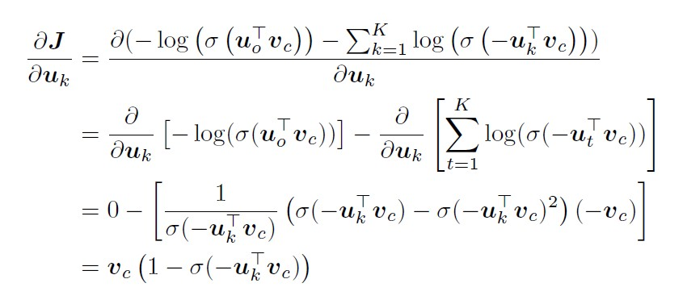

# Lecture 3: Backprop and Neural Networks

## Keynotes of lecture

This lecture mainly talks about:
- Neural Network learning: Gradients by hand
- Backpropagation in Neural Network

---

## Assignment 2 (Written Part)

(a). Solution:

(b). Solution:

(c). Solution:

case 1

case 2

(d). Solution:

(e). Solution:

(f). Solution:

(g). Solution:

(h). Solution:

