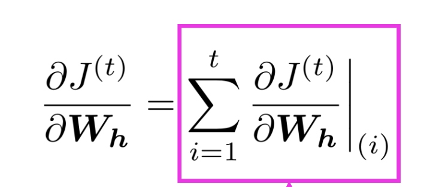
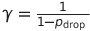
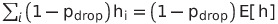
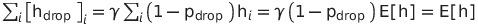
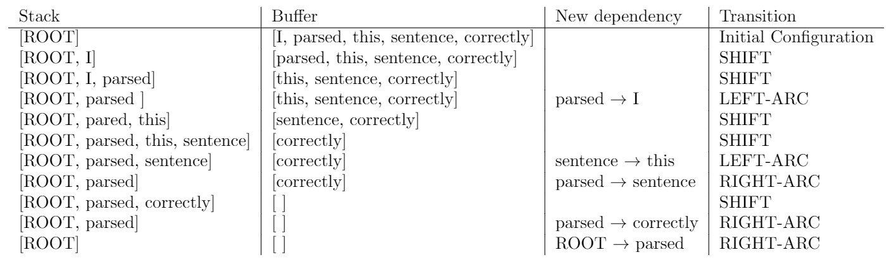

# Lecture 4: Language Models and Recurrent Neural Networks

This lecture mainly talks about Language Models and Rrcurrent Neural Networks (RNNs)

## Language Modeling

Informal Definition: Language Modeling is the task of predicting what word comes next.
```text
the student opened their ____
```

Formal Definition: Given a sequence of words, compute the probability distribution of the next word.

> Example of LM in our daily life: Google Search trys to complete the query when we are typing.

<br />

### n-gram Language models

n-gram definition: A n-gram is a chunk of n consecutive words.
- unigrams
- bigrams
- trigrams
- 4-grams
- ......
> Note the words order matters! "Lily has a dog" is different from "Dog has a Lily". 


We should get n-grams probabilities to compute LM! How to? **Counting them in some large corpus of text.**

<br />

### Sparsity Problems with n-gram LMs

Many n-grams haven never appeared in corpus. Their probility will also be zero. How to solve this?
- Smoothing: Add small number to the count for every w.

And, what if the prefix words of a n-gram have never shown in corpus?

- Just condition on sub-words of the prefix words. This is called backoff.

> Typically we can't have n bigger than 5.

We can use n-gram LMs to generate text.

<br />

### Neural Language Model

An idea is fix-windows neural LM

Advantages of fix-windows neural LMs compared to n-grams LMs:
1. No sparsity problem
2. Don't need to store all observed n-grams

Remaining problems:
1. Fixed windows is too small.
2. Enlarging windows enlarges W.
3. Windows can never be large enought!
4. ......

<br />

## RNNs

**RNNs can take sentences with any length in and apply the same weights on each step!**


RNNs advantages:
1. Can process any length input
2. Comiputation for step t use informantion from many steps back.
3. Model size doesn't increase for longer input.
4. Same weights applied on every timestep.

RNNs disadvantages:
1. Recurrent computation is slow.
2. In practice, difficult to access infomation from many steps back.

<br />

### Traning RNNs

calculate cross-entropy probability for evry step t.


Note that computing loss and gradients across entire corpus is too expensive. We usually compute loss on sentences.

<br />

### Backpropagation for RNNs

**The gradient w.r.t. a repeated weight is the sum of the gradient w.r.t. each time it appears**




Backpropagate over timesteps i=t,...,0, summing gradients as you go. This algorithm is called “**backpropagation through time**”

<br />

## Evaluating Language Models

The standard evaluation metricfor Language Models is **perplexity**.


> lower perplexity is better!

<br />

### RNNs' perplexity

RNNs have many complex variants, which improved performance. (lower perplexity)


<br />

## Applications for RNNs

1. Be used for tagging.
2. Sentence classification.
3. Be used as an encoder module.
4. Generate text.

<br />

---

# Assignment 3

## 1. Adam Optimizer

i. The momentum term increases for dimensions whose gradients point in the same directions and reduces updates for dimensions whose gradients change directions. (Look into this [Post](https://ruder.io/optimizing-gradient-descent/))

ii. The parameters which have smaller rolling average of the magnitudes of the gradients will  get  larger  update.

If the weights decay really slowly (where the v is small), then the learning rates will increase. If the weights decay fast (where the v is big), then the learning rates will decline.

<br />

## 2. Dropout

i. 



Proof:





ii. Simplest reason can be, during prediction(test, validation or after production deployment) you want to use the capability of each and every learned neurons and really don't like to skip some of them randomly.

<br />

## 3. Dependency Parsing

(a).



<br />

(b).

It needs 2 * n steps to parse. Because we need n steps of LEFT-ARC and n steps of RIGHT-ARC.

<br />

(c), (d) and (e) are in the .py files.

Final best result: **85.72%**
```text
================================================================================
TESTING
================================================================================
Restoring the best model weights found on the dev set
Final evaluation on test set
  0%|          | 0/2416 [00:00<?, ?it/s]- test UAS: 85.72
2919736it [00:00, 91391366.91it/s]      
Done!
```


