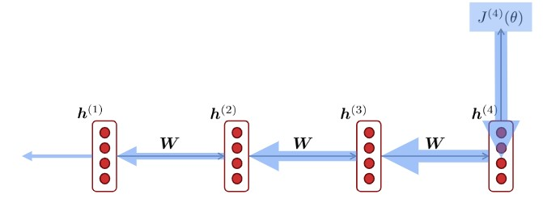
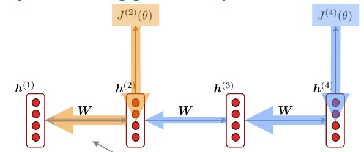
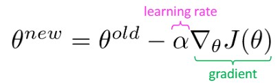
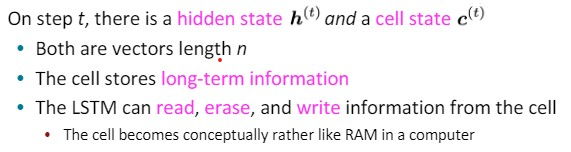
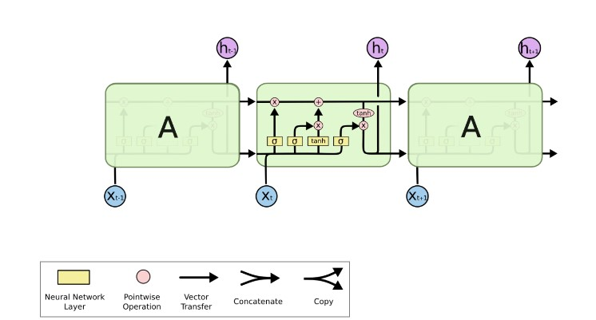
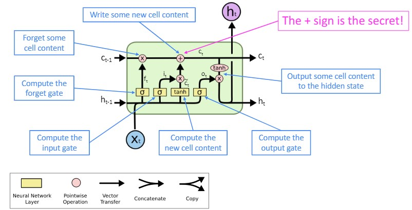
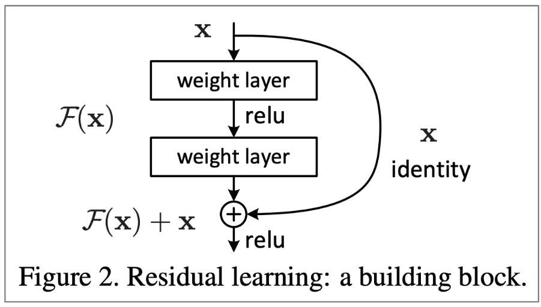

# Lecture 6: Vanishing Gradients, Fancy RNNs, Seq2Seq

## Vanishing gradient

**Vanishing gradient problem**: When these are small, the gradient signal gets smaller and smaller as it backpropagates further.



### Why is vanishing gradient a problem?

```text
Gradient signal from far away is lost because it’s much smaller than gradient signal from close-by. So, model weights are updated only with respect to near effects, not long-term effects.
```



```text
Another explanatino: Gradient can be viewed as a measure of the effect of the past on the future.
```

Due to vanishing gradient, RNN-LMs are better at learning from **sequential recency** than **syntactic recency**, so they make this type of error more often than we'd like.

### Why is exploding gradient a problem?

If the gradient becomes too big, then the SGD update step becomes too big:



This can cause bad updates:we take too large a step and reach a weird and bad parameter configuration (with large loss)
  - You think you’ve found a hill to climb, but suddenly you’re in lowa

In the worst case, this will result in Infor NaNin your network.

### How to fix the vanishing gradient problem?

The main problem is that **it’s too difficult for the RNN to learn to preserve information over many timesteps.**

> How about a RNN with separate memory?

<br />

## Long Short-Term Memory RNNs (LSTMs)

Key information of LSTMs:



A overlook of LSTMs:



1. Forget gate: controls what is kept vs forgotten, from previous cell state.
2. Input gate: controls what parts of the new cell content are written to cell.
3. Output gate: controls what parts of cell are output to hidden state.
4. New cell content: this is the new content to be written to the cell.
5. Cell state: erase (“forget”) some content from last cell state, and write (“input”) some new cell content.
6. Hidden state: read (“output”) some content from the cell.



### How does LSTM solve vanishing gradients?

```text
The LSTM architecture makes it easierfor the RNN to preserve information over many timesteps
```

In 2013–2015: LSTMs became the dominant approach for most NLP tasks!

Now (2021),other approaches (e.g., Transformers) have become dominant for many tasks

### Is vanishing/exploding gradient just a RNN problem?

No! It can be a problem for all neural architectures (including feed-forwardand convolutional), especially very deep ones.

**Solution**: lots of new deep feedforward/convolutional architectures that add more direct connections(thus allowing the gradient to flow).



**Conclusion**: Though vanishing/exploding gradients are a general problem, RNNs are particularly unstable due to the repeated multiplication by the same weight matrix.