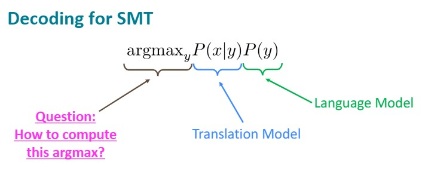
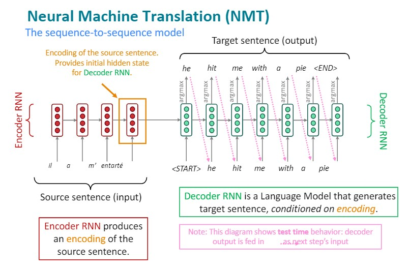
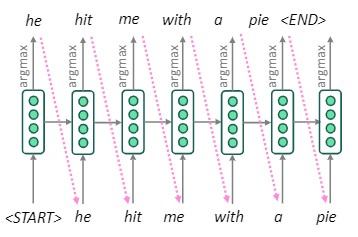
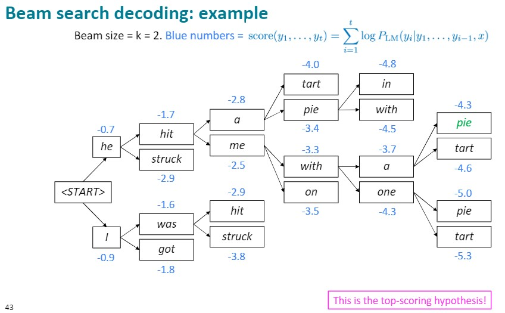
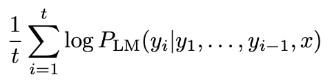
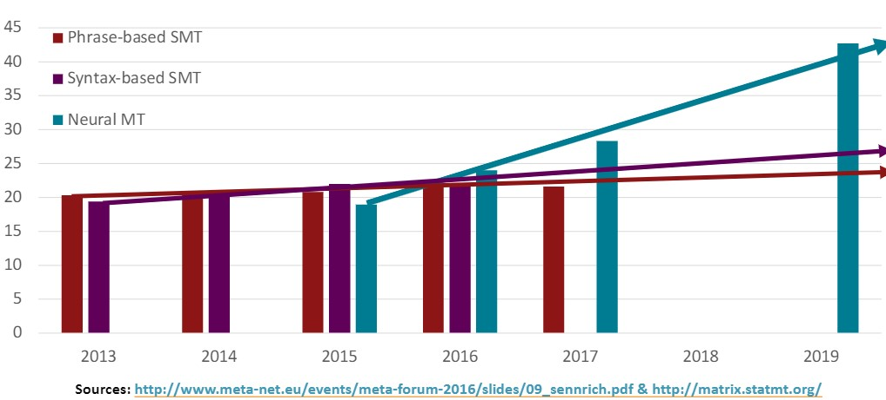
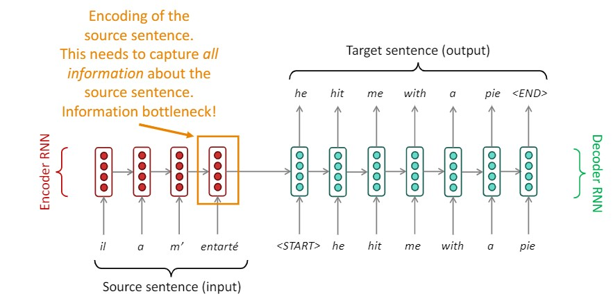
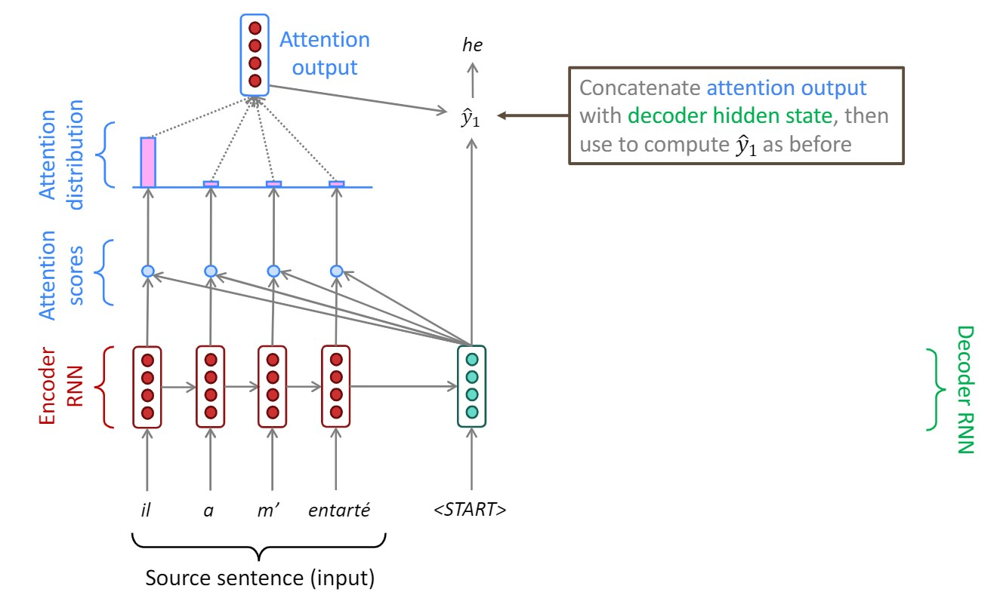

# Lecture 7: Machine Translation, Sequence-to-Sequence and Attention

This lecture talks about:

- Machine Translation
- Sequence-to-sequence model
- Attention

 

## Machine Translation

**Machine Translation**: is the task of translating a sentence x from one language (the source language) to a sentence y in another language (the target language).

### Pre-Machine Translation

In 1950s: Early Machine Translation, mainly Russian -> English (motivated by the cold war!)

In 1990s-2010s: Statistic Machine Translation:
- **core idea**: Learn a probabilistic modelfrom data

How to learn translation model?:
- Need large amount of parallel data. -> To know word alignment.

word alignment can be: one-to-one, one-to-many, many-to-one, many-to-many

**Decoding for SMT**: Find the best target sentence

 

### Neural Machine Translation

**Neural Machine Translation (NMT)**: is a way to do Machine Translation with a single end-to-end neural network

The neural network architecture is called a sequence-to-sequence model (aka seq2seq) and it involves two RNNs. We need two RNNs to handle the two different sentences.

The two RNNs: Encoder RNN and Decoder RNN

Many NLP tasks can be phrased as sequence-to-sequence:

- Summarization (long text → short text)
- Dialogue (previous utterances → next utterance)
- Parsing (input text → output parse as sequence)
- Code generation (natural language → Python code)

**Greedy decoding**: take most probable word on each step.

Problems with this method?

- Greedy decoding has no way to undo decisions! 

How to fix this?

- Exhaustive search decoding (far too expensive)

- Beam search decoding

#### Beam search decoding

**Core idea**: On each step of decoder, keep track of the k most probable partial translations (which we call hypotheses)

Usually we continue beam search until:

- We reach timestep T (where T is some pre-defined cutoff), or
- We have at least n completed hypotheses (where n is pre-defined cutoff)

Problem with Beam search decoding: **longer hypotheses have lower scores**.

Fix this problem: **Normalize by length**.

#### Advantages of NMT

- Better performance
     - More fluent
     - Better use of context
     - Better use of phrase similarities

- A single neural networkto be optimized end-to-end
     - No subcomponents to be individually optimized

- Requires much less human engineering effort
     - No feature engineering
     - Same method for all language pairs

#### Disadvantagesof NMT

- NMT is less interpretable
     - Hard to debug

- NMT is difficult to control
     - For example, can’t easily specify rules or guidelines for translation
     - Safety concerns!

 

### How do we evaluate Machine Translation?

**BLEU** (**B**i**l**ingual **E**valuation **U**nderstudy)

BLEU compares the machine-written translationto one or several human-written translation(s), and computes a similarity score based on:

- n-gram precision 
- Plusa penalty for too-short system translations

 

### MT progress over time

 

### Many difficulties remain for MT:

- Out-of-vocabulary words
- Domain mismatch between train and test data
- Maintaining context over longer text
- Low-resource language pairs
- Failures to accurately capture sentence meaning
- Pronoun (or zero pronoun) resolution errors
- Morphological agreement errors

 

## Attention

Sequence-to-sequence: the bottleneck problem:

Sequence-to-sequence with attention:

